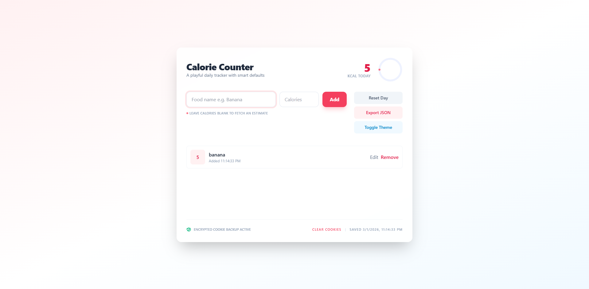

# Calorie Counter App

A compact, interactive calorie tracker built with **HTML**, **Tailwind CSS**, and **JavaScript**. Log daily food items, get instant calorie totals and progress toward a daily goal, and persist data across browser sessions using `localStorage` (with a cookie backup).

**Contributor**  
Karma Kioko

---

## Project Brief
This project implements a lightweight calorie-tracking web app that lets users add, edit, and remove food entries while automatically calculating the total calories and showing progress toward a daily goal. The UI is responsive, playful, and includes small micro‑interactions to make tracking pleasant and fast.

---

## Key Features
- **Add Food Items** — Enter a food name and optional calorie value; leave calories blank to fetch a simulated estimate.
- **Automatic Total Calculation** — Total calories update in real time as items are added, edited, or removed.
- **Daily Progress Ring** — Visual progress indicator toward a default daily goal (configurable in code).
- **Daily Item Counter** — Shows the number of logged entries (derived from stored items).
- **Persistent Storage** — Primary persistence via `localStorage`; compact cookie backup for redundancy.
- **Edit & Delete** — Edit entries via prompts and remove items with a single click.
- **Reset Day** — Clear all entries for a fresh start with confirmation.
- **Export JSON** — Copy the stored data to clipboard (or open in a new tab) for quick export.
- **Theme Toggle** — Switch between light and dark styling using a `data-theme` attribute.
- **Fetch Simulation** — Demonstrates `fetch` usage with an AbortController and a local heuristic fallback for calorie estimates.

---

## Technologies Used
- **HTML5**
- **Tailwind CSS** (CDN for quick demo)
- **JavaScript (ES6+)**
- **localStorage** and **Cookies**
- **Fetch API** (simulated endpoint)
- **SVG** for the progress ring

---

## Screenshot


---

## Live Link
`https://kxrma35.github.io/Calorie-Counter/`

---

## Usage Instructions

1. **Clone the repository**
   ```bash
   git clone git@github.com:Kxrma35/calorie-counter.git

2. Open the project folder.

3. Open `index.html` in any modern web browser.

## Known Bugs
- There are currently no known bugs.

## Support and Contact Information
Email: karmanjeruh5@gmail.com

